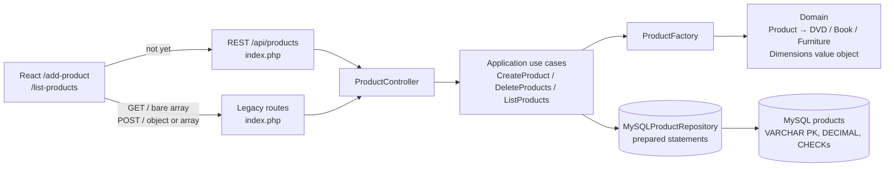
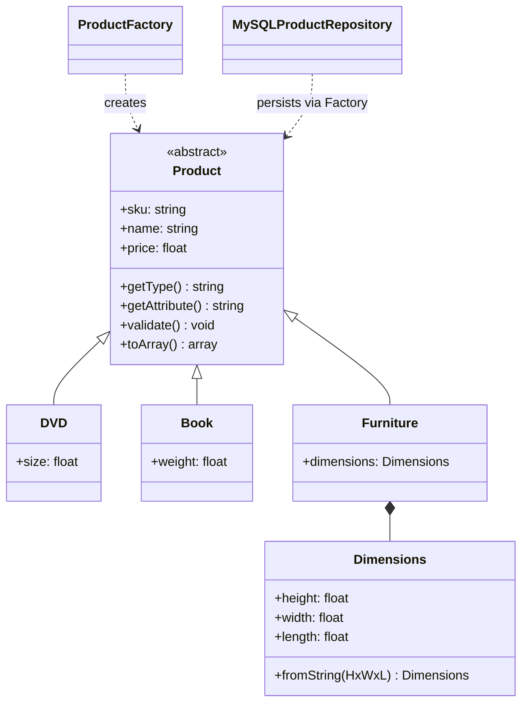
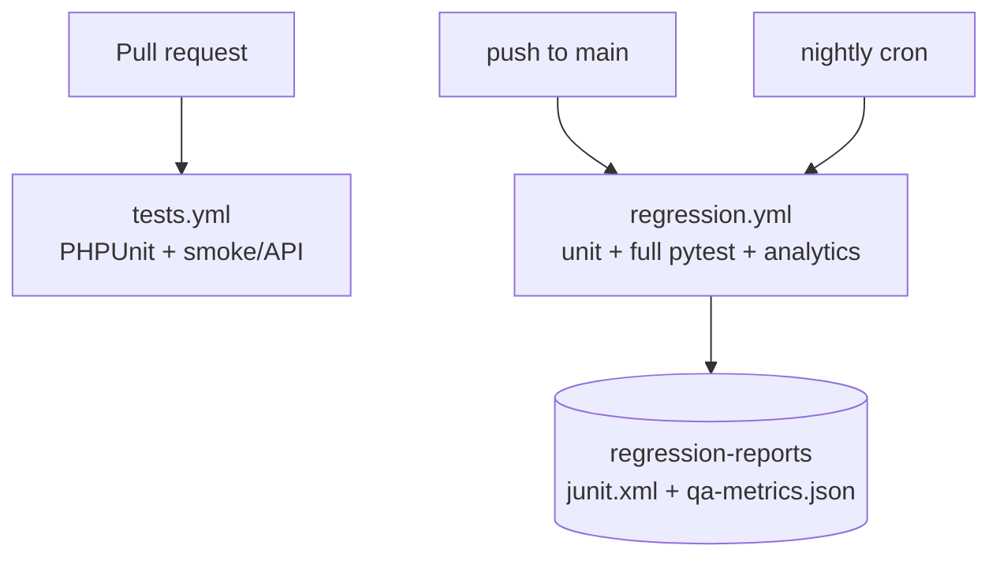

# Architecture Diagrams (Phase 8, step 39)

## 1. Request flow (after Phase 2–3)

```mermaid
flowchart LR
    UI[React /add-product\n/list-products] -->|GET / bare array\nPOST / object or array| Legacy[Legacy routes\nindex.php]
    UI -->|not yet| REST[REST /api/products\nindex.php]
    REST --> C[ProductController]
    Legacy --> C
    C --> UC[Application use cases\nCreateProduct / DeleteProducts / ListProducts]
    UC --> F[ProductFactory]
    F --> D[Domain\nProduct → DVD / Book / Furniture\nDimensions value object]
    UC --> R[(MySQLProductRepository\nprepared statements)]
    R --> DB[(MySQL products\nVARCHAR PK, DECIMAL, CHECKs)]
```

## 2. Domain hierarchy

```mermaid
classDiagram
    class Product {
        <<abstract>>
        +sku: string
        +name: string
        +price: float
        +getType() string
        +getAttribute() string
        +validate() void
        +toArray() array
    }
    class DVD {
        +size: float
    }
    class Book {
        +weight: float
    }
    class Furniture {
        +dimensions: Dimensions
    }
    class Dimensions {
        +height: float
        +width: float
        +length: float
        +fromString(HxWxL) Dimensions
    }
    Product <|-- DVD
    Product <|-- Book
    Product <|-- Furniture
    Furniture *-- Dimensions
    ProductFactory ..> Product : creates
    MySQLProductRepository ..> Product : persists via Factory
```

## 3. CI pipeline

```mermaid
flowchart TD
    PR[Pull request] --> T1[tests.yml\nPHPUnit + smoke/API]
    PUSH[push to main] --> R1[regression.yml\nunit + full pytest + analytics]
    NIGHT[nightly cron] --> R1
    R1 --> ART[(regression-reports\njunit.xml + qa-metrics.json)]
```
